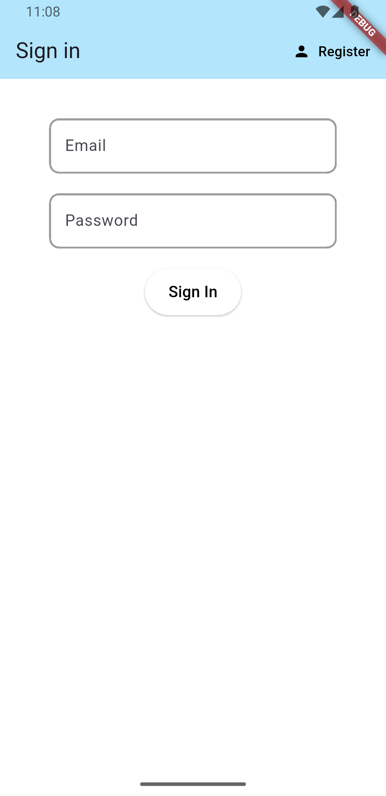
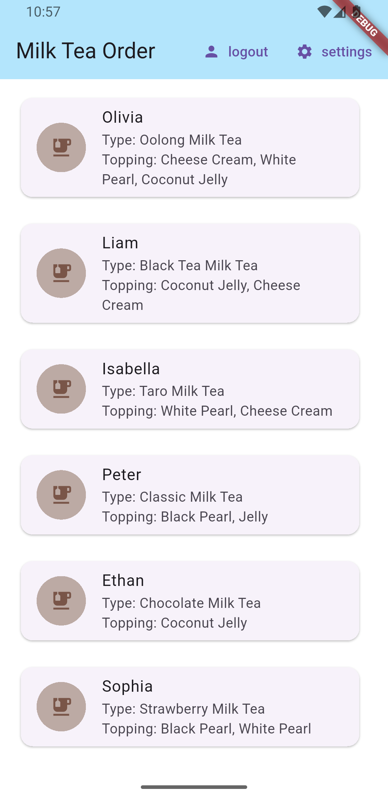
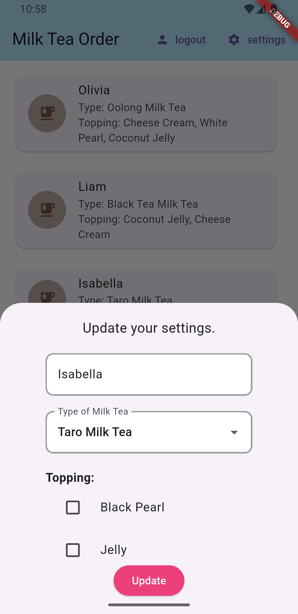

# Milk Tea Order App


## Project Description
Milk Tea Order App allows users to register, log in, select their favorite milk tea type and toppings, and save personal information. The project aims to provide a convenient, user-friendly milk tea ordering experience, with a modern interface and easy extensibility for more drink types.

## Visual Help





## Installation Guide

### 1. Install Flutter SDK
- Visit [Flutter Install](https://docs.flutter.dev/get-started/install) and follow the instructions for your OS (Windows, macOS, Linux).
- Make sure Flutter is added to your PATH environment variable.
- Check your setup with:
	```bash
	flutter doctor
	```
	If there are no red errors, you are ready to go.

### 2. Clone the project source code
- Open terminal/cmd and run:
	```bash
	git clone <https://github.com/Huytran2k5/Mid-term-CPMAD.git>
	cd <project-folder>
	```

### 3. Install dependencies
- Run:
	```bash
	flutter pub get
	```
- Make sure there are no package errors.

### 4. Set up Firebase for Android/iOS
- Go to [Firebase Console](https://console.firebase.google.com/) and create a new project.
- Add Android app:
	- Get the package name from `android/app/src/main/AndroidManifest.xml`.
	- Download `google-services.json` and place it in `android/app/`.
- Add iOS app:
	- Get the bundle identifier from `ios/Runner.xcodeproj`.
	- Download `GoogleService-Info.plist` and place it in `ios/Runner/`.
- In Firebase Console, go to **Authentication** > **Sign-in method** > click **Add new provider** > select **Email/Password** > enable **Enable** > click **Save** to activate email login.
- Next, go to **Firestore Database** > click **Create database** > choose test or production mode as needed > click **Next** and complete the steps to create the database.
- Make sure you have added the required Firebase plugins to your `pubspec.yaml`:
	```yaml
	dependencies:
		flutter:
			sdk: flutter
		firebase_core: ^latest
		firebase_auth: ^latest
		cloud_firestore: ^latest
		provider: ^latest
	```
- After editing `pubspec.yaml`, run:
	```bash
	flutter pub get
	```
- For Android, check `android/build.gradle` and `android/app/build.gradle` for Google Services configuration as per Firebase instructions.
- For iOS, check `ios/Podfile` to ensure `platform :ios, '10.0'` or higher is uncommented, and run `pod install` in the `ios/` directory if needed.

### 5. Build and run the app
- Make sure a real device or emulator is ready.
- Run:
	```bash
	flutter run
	```
- For first-time iOS runs, you may need to open Xcode, grant permissions, and build manually.

### 6. Notes
- If you encounter plugin version errors, check and synchronize versions in `pubspec.yaml`.
- If you encounter Firebase errors, check your config files and permissions in Firebase Console.

## Usage & Examples
- Register a new account or log in.
- Select your favorite milk tea type and toppings in the settings section.
- Save your personal information and view the list of other users.

## Contribution
- All contributions are welcome!
- Please create a pull request or issue.
- Requirements: follow clean code rules, provide clear descriptions, and do not violate copyright.

## Troubleshooting & FAQ
- **Firebase error [core/no-app]:** Make sure you called `Firebase.initializeApp()` in `main.dart`.
- **Email registration error:** Check for a valid email that does not already exist in the system.
- **New toppings not showing:** Check the toppings list in the model and UI.

## Dependencies
- flutter
- firebase_core
- firebase_auth
- cloud_firestore
- provider

See details in `pubspec.yaml`.

## Support
- Email: 523H0033@student.tdtu.edu.vn
- Email: 523H0002@student.tdtu.edu.vn

## Credits
- Development team:
		Tran Duc Huy
		Nguyen Duc Anh

## References & Related URLs
- [Flutter](https://flutter.dev)
- [Firebase](https://firebase.google.com)
- [Provider](https://pub.dev/packages/provider)

## License
MIT License. See LICENSE file for details.

## Changelog
- v1.0.0: Project initialized, basic features.
- v1.1.0: Added topping feature, new UI.

## Known Issues
- Dark mode not supported yet.
- No real ordering feature yet.

# gkdnt

A new Flutter project.

## Getting Started

This project is a starting point for a Flutter application.

A few resources to get you started if this is your first Flutter project:

- [Lab: Write your first Flutter app](https://docs.flutter.dev/get-started/codelab)
- [Cookbook: Useful Flutter samples](https://docs.flutter.dev/cookbook)

For help getting started with Flutter development, view the
[online documentation](https://docs.flutter.dev/), which offers tutorials,
samples, guidance on mobile development, and a full API reference.